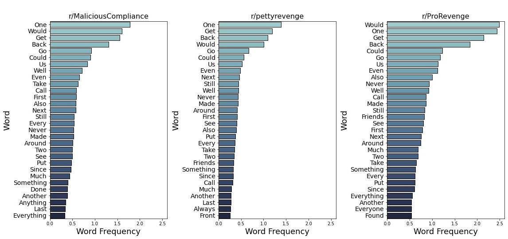
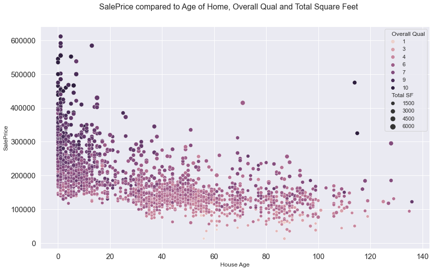

## Projects

[Classifying Passive vs. Active Revenge in Related Subreddits using NLP](https://github.com/ebsiegs/subreddit_nlp.git)

*This project uses and evaluates a variety of classification models including Logistic Regression, regularized Lasso Logistic Regression, Random Forest, and Multinomial Naïve Bayes in order to model the distinction between active and passive revenge in the related subreddits: r/MaliciousCompliance, r/ProRevenge, and r/pettyrevenge.*

[Predicting Ames, Iowa Real Estate Prices with Linear Regression](https://github.com/ebsiegs/housing_price_prediction)

*In this project I built a regression model that predicts home sale prices in Ames, Iowa given an input file with 80 columns of different home features and about 2,050 homes. I set out to try and identify what those major factors are for homes on the market in Ames, in addition to predicting Sale Price for those homes.*

## Publications

[Employing a Suite of Machine-Learning Algorithms in a Holistic Approach to Trouble-Stage Recognition and Failure Diagnostics.](https://onepetro.org/SPEHFTC/proceedings-abstract/21HFTC/1-21HFTC/461792) SPE 204145 (2021)

## Presentations

**Data Science Case Studies and Hands-On Learning to Gain Operational Efficiencies** - Well Data Labs Webinar, June 11 2020
